

# 📱 ScanPro

### QR Scanner, Barcode Creator & Batch Tools

**Scan, create and export QR codes and barcodes on your Android device.**  
Clean. Fast. Free with optional Premium and ad-free Supporter tiers.

---
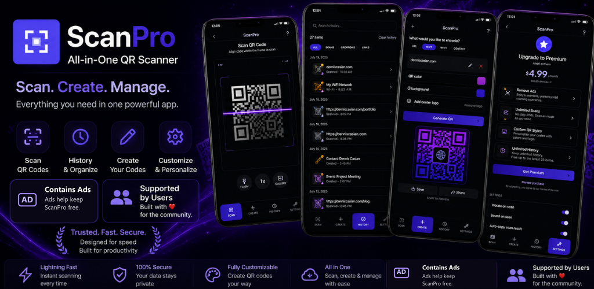

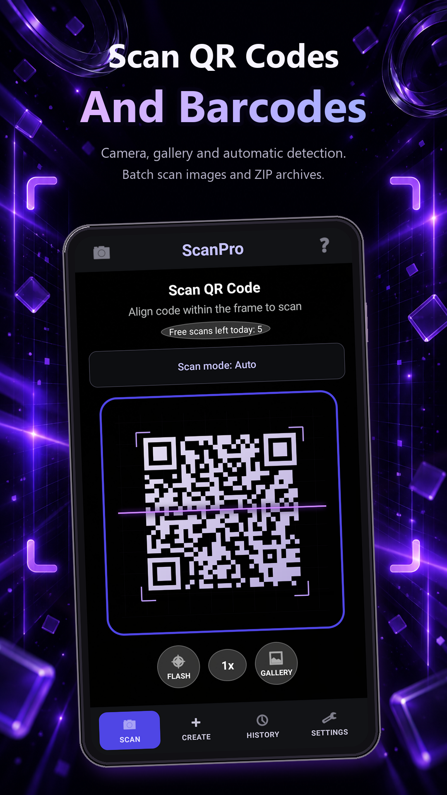
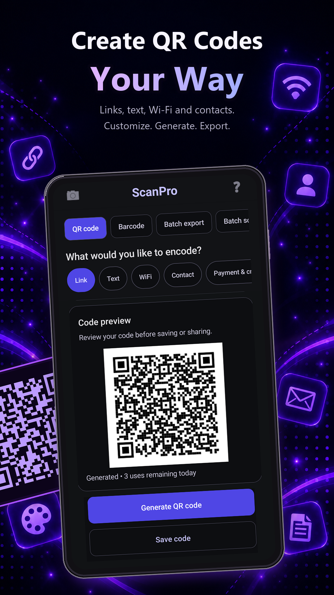
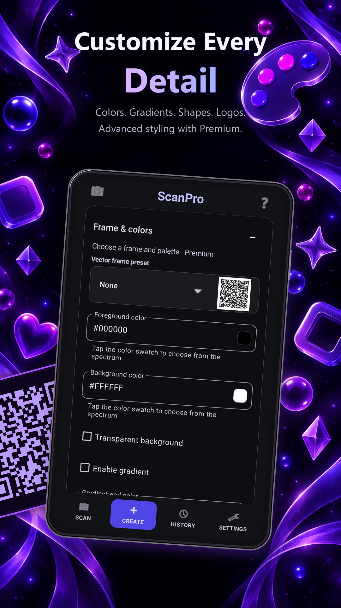
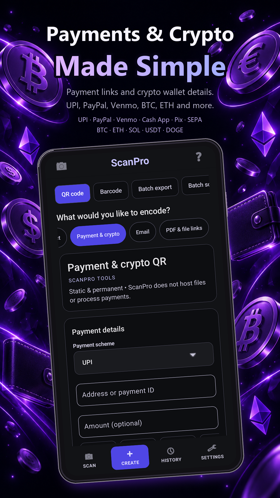
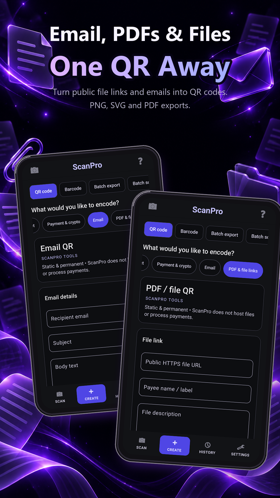
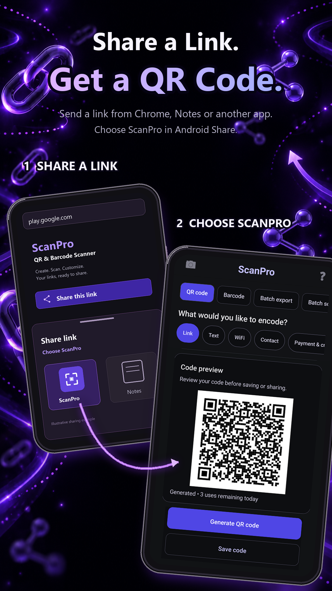
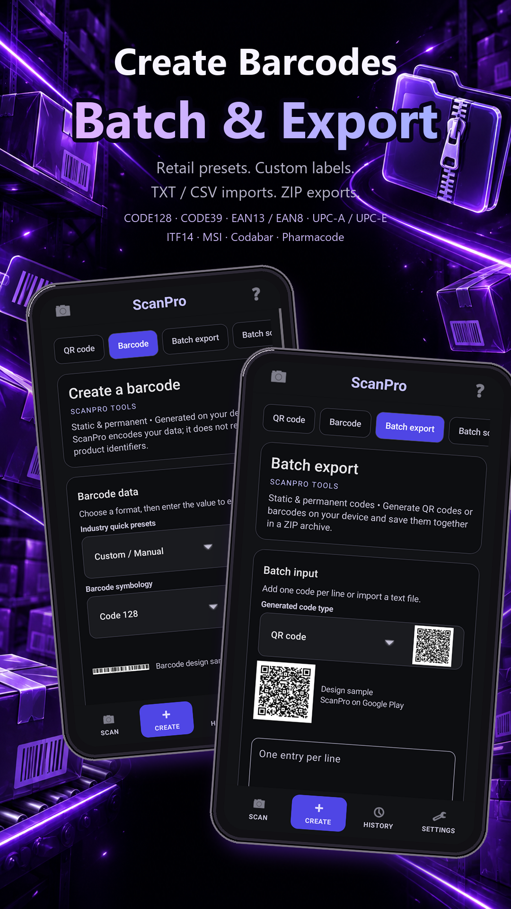
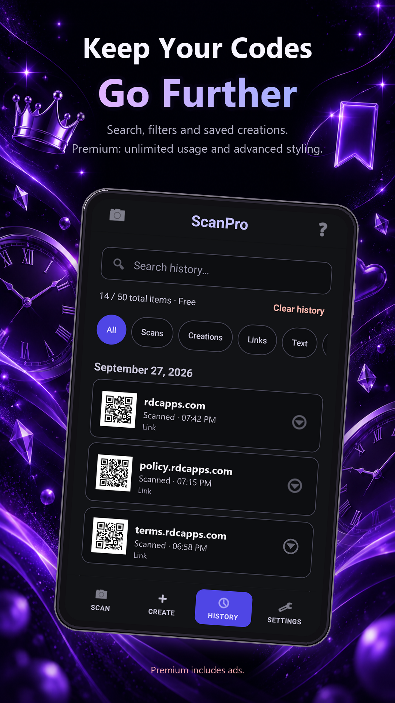

---

## 📱 About ScanPro

**ScanPro** is a modern QR and 1D barcode scanner and creator for Android.
Scan with the camera or selected images, create useful codes, customize their
appearance, and export them individually or in a batch ZIP — with searchable
local history and an interface that supports phones and tablets.

QR and barcode encoding/decoding takes place **on your device**.
No ScanPro account is required, and ScanPro does not host uploaded files or process payments.

> ### 🔔 Free App — Supported by Advertising
> ScanPro contains **Google AdMob** banner, native, interstitial, app-open and optional rewarded ads.  
> **One-time Support** removes ads while its entitlement is valid; **Monthly Supporter** removes ads while subscribed.  
> Premium and Premium Lifetime unlock features — they **do not** remove ads.

---

## ✨ Features

### 📷 QR & Barcode Scanning
- Camera scanning with flash and zoom
- Gallery image import and on-device decoding
- Automatic detection of supported QR and 1D formats
- Batch scan sessions with collected results and CSV export
- Batch import from images or ZIP archives containing code images
- Copy, open and share results
- Pharmacode/MSI reading requires the corresponding explicit scan mode

### 🔗 Useful QR Types

| Type | Content |
|---|---|
| **Link** | Website URL; HTTPS is added to valid domains without a scheme |
| **Text** | A message stored directly in the QR |
| **Wi-Fi** | Network details, security and hidden SSID |
| **Contact** | vCard contact fields |
| **Payment & crypto** | Payment requests/profile links and supported wallet addresses |
| **Email** | Recipient, subject and body |
| **PDF & file links** | Public HTTPS URLs to files you host elsewhere |

Payment options include UPI, Venmo, Cash App, PayPal.Me, Pix, SEPA/EPC and UK bank-transfer details.
Wallet options include Bitcoin, Ethereum, Solana, Ethereum-network USDT and Dogecoin.
Pix accepts an existing bank-issued BR Code. Platform compatibility depends on the receiving app.

Use **Android Share → ScanPro** to receive a URL or text from another app and generate a QR.

### 🏷️ Dedicated Barcode Creator
- Code 128, Code 39, EAN-13, EAN-8, UPC-A and UPC-E
- ITF-14, MSI, Codabar and Pharmacode
- Format-specific validation and check-digit guidance
- One-tap retail, e-commerce, logistics, library and medical presets
- Premium colors, bar dimensions, margins and human-readable text controls
- Font, weight/style, size, spacing, position and alignment settings

Presets configure appearance; they do not register product identifiers or certify compliance with a retailer.

### 🎨 Appearance & Export
- Premium QR colors, gradients and transparent backgrounds
- Square, rounded, circular, diamond, heart and star modules
- Separate corner frame/center shapes and colors
- Frame presets, built-in icons and custom center logos
- Visual color spectrum and independent design samples
- **PNG, SVG and printable PDF** export
- **Batch ZIP** export with PNG/SVG files, indexed filenames and a manifest
- Paste one payload per line or import **TXT / CSV**

### 🗂️ Additional Features
- Local history with search, category filters and saved generated appearance
- Light, dark and system themes
- Portrait layout on phones and rotation on tablets
- Guides and FAQ for code formats, design, printing, scanning, privacy and purchases
- Reset appearance defaults and review generated codes before exporting

---

## 👑 Premium Features

| Feature | Free | Premium / Lifetime |
|---|:---:|:---:|
| QR & barcode scans | 5/day | Unlimited daily |
| QR creation, shared across QR types | 5/day | Unlimited daily |
| Barcode creation | 5/day | Unlimited daily |
| Batch export | 1/day | Unlimited daily |
| Batch scan sessions | 1/day | Unlimited daily |
| Local history | Newest **50 total** | Unlimited history* |
| Standard black-and-white codes | ✅ | ✅ |
| PNG, SVG and PDF export | ✅ | ✅ |
| QR shapes, gradients, frames and logos | ❌ | ✅ |
| Barcode appearance & typography | ❌ | ✅ |
| Remove advertising | ❌ | ❌ — Supporter required |

*History has a high device-storage safety cap. Batch archives remain limited to 500 entries;
ZIP reading is bounded to 100 images. Premium removes daily quotas, not memory protections.
Where available, an optional rewarded ad grants one extra use in the exhausted category.

---

## 💳 Pricing

ScanPro is **free** and supported by Google AdMob advertising. All paid tiers are optional.
Prices, currency and trial eligibility are displayed by Google Play before purchase.

### One-Time Purchases

| Product | Price | Description |
|---|:---:|---|
| 💎 **ScanPro Premium Lifetime** | Shown in Google Play | All Premium features with one payment. **Ads are still shown.** |
| ❤️ **One-time Support** | Shown in Google Play | **Removes advertising** while the entitlement is valid. Does not grant Premium usage limits or customization. |

### Subscriptions

| Product | ID | Price | Trial | Benefits |
|---|---|:---:|:---:|---|
| 👑 **ScanPro Premium** | `scanpro_premium_monthly_v2` | Shown in Google Play | 7 days where eligible | Unlimited daily usage, history and advanced customization. **Ads are still shown.** |
| ❤️ **Monthly Supporter** | `scanpro_supporter_monthly` | Shown in Google Play | As offered in Google Play | **Removes advertising while active.** Premium features are separate. |

> Supporter plans help keep ScanPro available and actively developed.
> Cancellation, expiry and refunds follow Google Play and the applicable entitlement.
> Buying Lifetime does not automatically cancel an existing subscription.

---

## 🛡️ Privacy

ScanPro uses **on-device code processing** alongside clearly disclosed advertising and purchases:

| | |
|---|---|
| 🔔 | AdMob ads for users without a valid ad-removal entitlement, including Premium users |
| ✅ | Applicable privacy choices managed through Google UMP |
| ✅ | Available consent options accessible in Settings → Ad privacy choices |
| ✅ | Verified Supporter ad-removal access prevents AdMob initialization and hides ad slots |
| ✅ | Camera frames, selected code images and code contents are processed locally |
| ✅ | History and appearance snapshots stored in private app storage |
| ✅ | Purchases managed by Google Play + RevenueCat |
| ℹ️ | AdMob may process IP addresses, identifiers, ad interactions and diagnostics |

Changing consent or removing ads does not automatically delete data already processed by service providers.

→ **[Full Privacy Policy](./PRIVACY_POLICY.md)**

---

## 🔗 Download

**[ScanPro on Google Play](https://play.google.com/store/apps/details?id=com.qrscanpro.dc)**

---

## 🧩 Code Processing & Technology

ScanPro uses ZXing for encoding, Google ML Kit for supported image/camera decoding,
AndroidSVG for SVG rendering, Google Play + RevenueCat for purchases, and
Google AdMob + UMP for advertising and applicable consent choices.
Third-party components retain their respective licenses and terms.

Static QR codes encode their content directly. Public file links depend on the destination
remaining available. Payment QR codes do not transfer funds; verify the destination and network.

---

## 📸 Tablet Screenshots

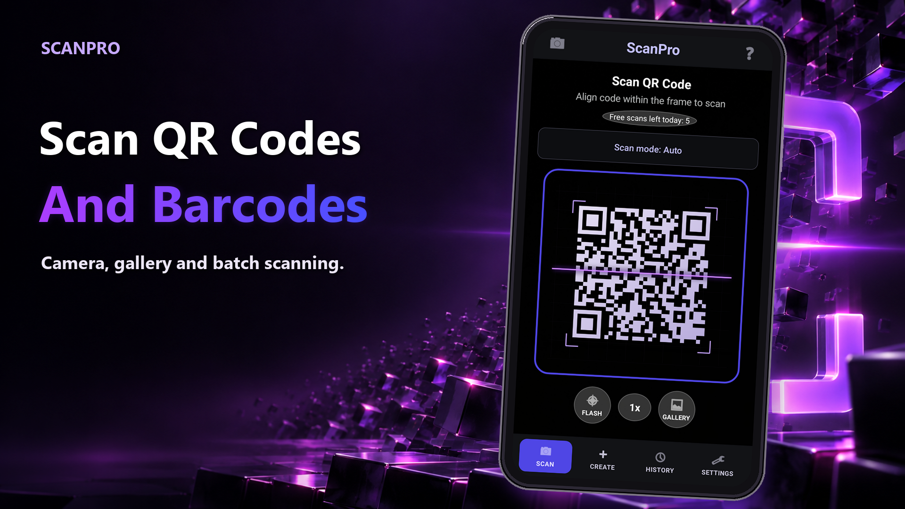
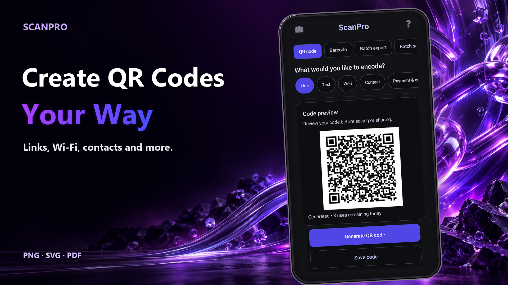
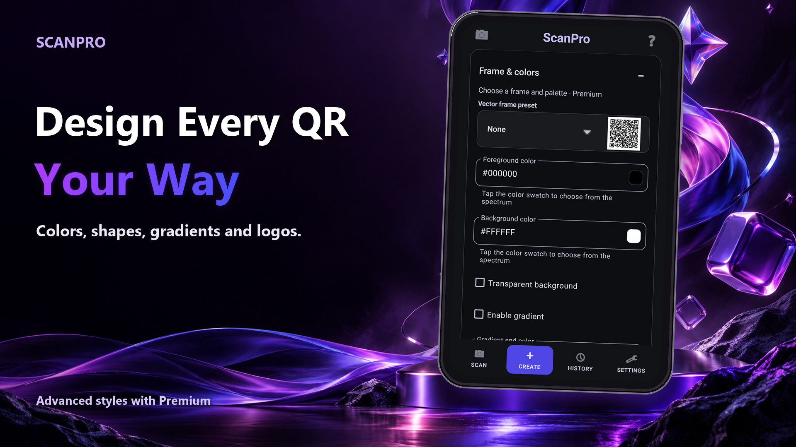
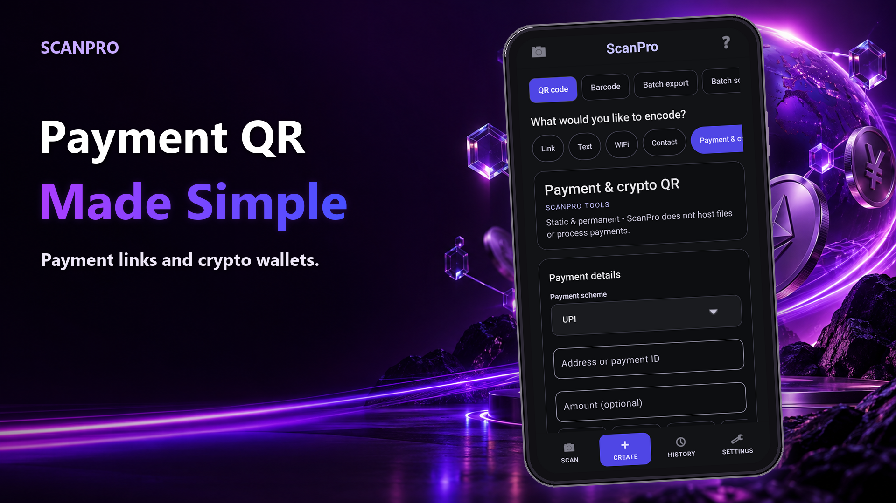
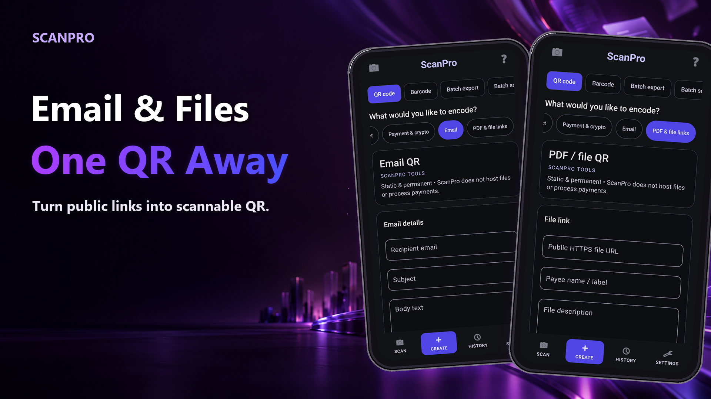
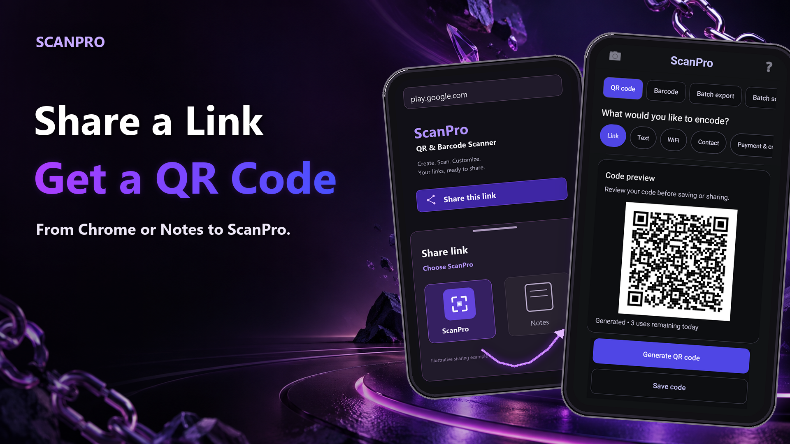
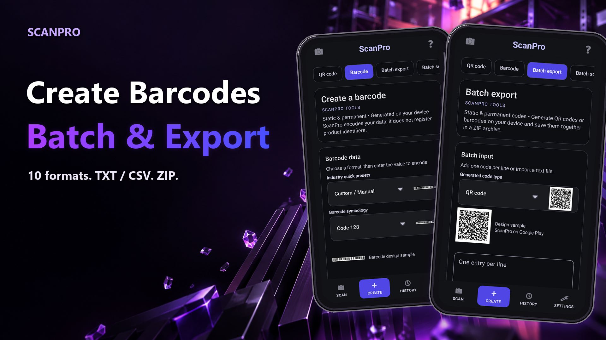
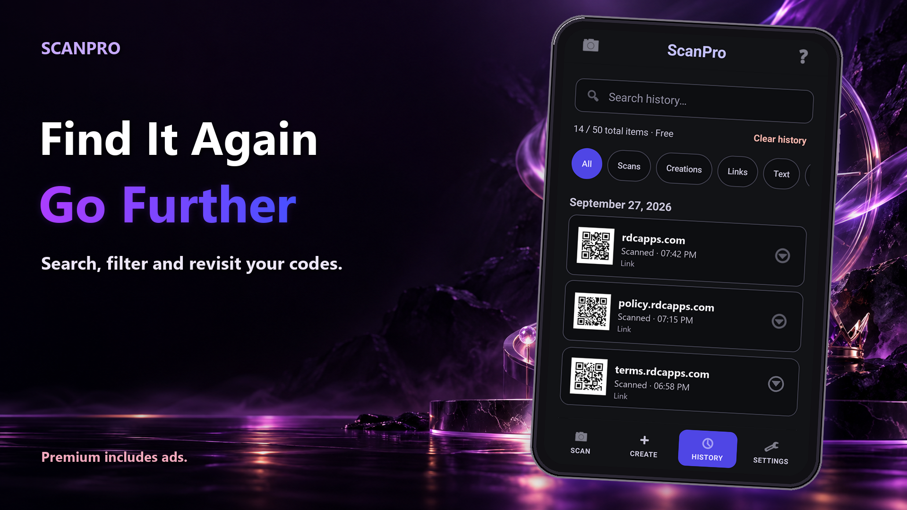

Romanian promotional assets

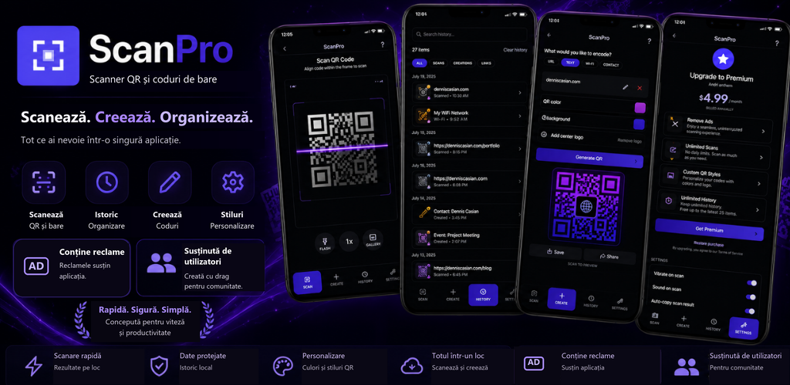

---

## 📄 Legal Documents

| Document | Description |
|---|---|
| [Privacy Policy](./PRIVACY_POLICY.md) | Code data, advertising, consent and purchases |
| [Terms of Use](./TERMS_OF_SERVICE.md) | Rules for using ScanPro |
| [License](./LICENSE) | Proprietary software license |
| [Security Policy](./SECURITY.md) | How to report vulnerabilities |
| [Changelog](./CHANGELOG.md) | Documented changes |
| [Support](./SUPPORT.md) | Help and contact information |

---

## 👤 Developer

**Denis Casian** — Independent developer, Romania 🇷🇴

| | |
|---|---|
| 🌐 Website | [deniscasian.com](https://deniscasian.com) |
| 📧 Support | [support@rdcapps.com](mailto:support@rdcapps.com) |
| 🐛 Bug Reports | [bugs.rdcapps.com](https://bugs.rdcapps.com) |
| 📱 App | [ScanPro on Google Play](https://play.google.com/store/apps/details?id=com.qrscanpro.dc) |
| 🌐 Presentation | [apps.deniscasian.com/scanpro.html](https://apps.deniscasian.com/scanpro.html) |

---

Made with ❤️ for everyday scanning and creation.

**[Download ScanPro](https://play.google.com/store/apps/details?id=com.qrscanpro.dc)** ·
**[Privacy Policy](./PRIVACY_POLICY.md)** ·
**[Terms of Use](./TERMS_OF_SERVICE.md)**

*© 2026 ScanPro — Denis Casian. All rights reserved.*

